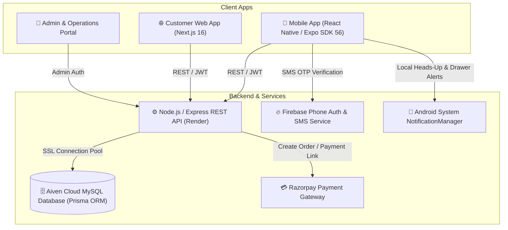
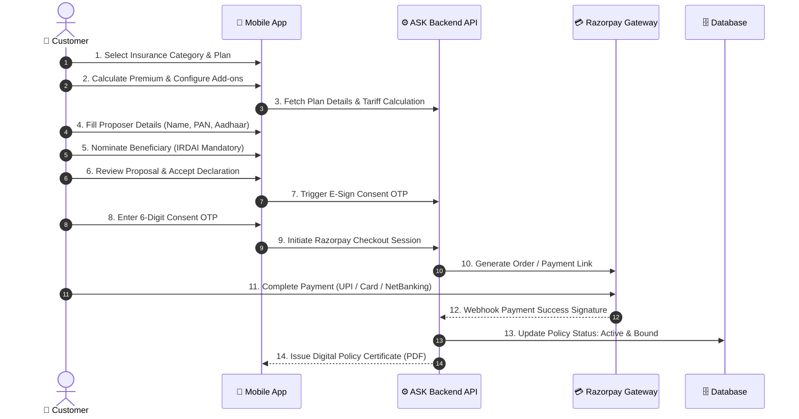
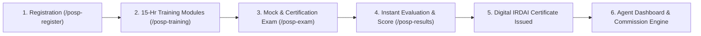
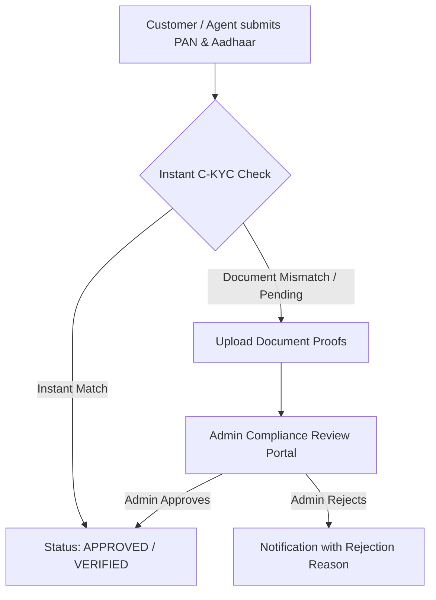
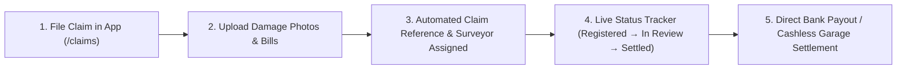

# ASK Insurance Broker — Complete Platform Documentation & Guide

A modern, IRDAI-compliant digital insurance broker platform providing end-to-end policy discovery, smart quotation, automated underwriting, POSP training & certification, instant KYC verification, claims management, and integrated Razorpay payment processing across Android, iOS, and Web.

---

## 📑 Table of Contents

1. [Architecture & Ecosystem Overview](#-architecture--ecosystem-overview)
2. [Step-by-Step Insurance Policy Buying Workflow (Up to Razorpay)](#-step-by-step-insurance-policy-buying-workflow-up-to-razorpay)
3. [POSP (Point of Sales Person) Agent Certification Workflow](#-posp-point-of-sales-person-agent-certification-workflow)
4. [KYC & Document Verification Workflow](#-kyc--document-verification-workflow)
5. [Claims Filing & Settlement Workflow](#-claims-filing--settlement-workflow)
6. [Admin & Operations Management Portal](#-admin--operations-management-portal)
7. [System Notification Engine](#-system-notification-engine)
8. [Tech Stack & Engineering Standards](#-tech-stack--engineering-standards)
9. [Local Development & Deployment Guide](#-local-development--deployment-guide)

---

## 🏛 Architecture & Ecosystem Overview



---

## 🛒 Step-by-Step Insurance Policy Buying Workflow (Up to Razorpay)

Buying an insurance policy on the ASK Insurance mobile or web platform follows an intuitive, compliant 8-step journey:



### Detailed Purchase Steps

#### 1. Plan Discovery & Category Selection
- Open the mobile application and tap the **Plans** tab (or choose a category from the Home dashboard: *Health, Motor, Life, Travel, Home, Business*).
- Use dynamic filters to sort by Claim Settlement Ratio (CSR), Network Hospitals, Zero-Depreciation eligibility, or Insurer Brand (38+ insurers including ICICI Lombard, HDFC ERGO, Bajaj Allianz, Care Health).

#### 2. Quote Calculation & Add-on Customization
- Choose coverage tiers (e.g. ₹5 Lakh to ₹1 Crore Sum Insured).
- For **Motor Insurance**: Enter vehicle registration number (e.g., `HR26DQ5555`) to auto-fetch vehicle make, model, cubic capacity, RTO, and rollover No-Claim Bonus (NCB).
- Select optional riders: *Zero Depreciation, 24x7 Roadside Assistance (RSA), Engine Protector, Consumables Cover, Personal Accident Cover*.

#### 3. Proposer & Insured Details Entry (`Step 1 of 3`)
- Verify proposer full legal name as per PAN / Aadhaar.
- Input verified mobile number, email address, date of birth, gender, and residential address with PIN code.
- Provide PAN Number and Aadhaar Number for automatic C-KYC validation.

#### 4. Mandatory IRDAI Nominee Appointment (`Step 2 of 3`)
- Enter the legal nominee's full name.
- Select relationship with the proposer (*Spouse, Son, Daughter, Father, Mother, Other*).
- Specify the nominee's age (appoint guardian details if nominee is a minor).

#### 5. Proposal Review & Statutory Declaration (`Step 3 of 3`)
- Review complete proposal summary: Proposer identity, chosen plan, appointed nominee, sum insured, net premium, 18% GST, and total payable amount.
- Check and agree to the IRDAI statutory declaration of insurability and terms of contract.

#### 6. E-Sign Consent OTP Verification
- Tap **🔒 Verify via OTP & Pay**.
- Enter the 6-digit carrier SMS consent OTP dispatched to the registered mobile number to legally execute the electronic proposal.

#### 7. Razorpay Payment Gateway Checkout
- The system invokes Razorpay's secure checkout environment.
- Supported payment methods:
  - **UPI Instant**: Google Pay, PhonePe, Paytm, BHIM, and UPI QR Code.
  - **Cards**: RuPay, Visa, Mastercard, and American Express (Credit & Debit).
  - **NetBanking**: All major Indian public and private sector banks.
  - **EMI / PayLater**: Eligible banking EMI and digital credit lines.

#### 8. Instant Policy Issuance & Document Generation
- Real-time cryptographic signature verification activates the policy instantly.
- The system renders an official IRDAI-formatted **Policy Certificate** with Policy Number, QR validation code, coverage schedule, and insurer seal.
- Download PDF directly or access anytime from the **Policies** tab.

---

## 🎓 POSP (Point of Sales Person) Agent Certification Workflow

The platform provides a complete built-in training, examination, and licensing module for insurance agents under IRDAI POSP guidelines:



### Steps to Become a Certified POSP Agent

1. **POSP Onboarding & KYC Submission**:
   - Access **Become a POSP Agent** from the profile screen or navigate to `/posp-register`.
   - Submit Educational Qualification (Minimum 10th pass / Matriculation), PAN card, Aadhaar card, Bank Account details for commission payouts, and recent photograph.
2. **15-Hour Mandatory Training Course**:
   - Complete 5 structured modules covering:
     - Module 1: *Introduction to Insurance & Principles of Utmost Good Faith*
     - Module 2: *Life & Term Insurance Products*
     - Module 3: *General & Motor Insurance Underwriting*
     - Module 4: *Health Insurance, Mediclaim & Critical Illness*
     - Module 5: *IRDAI Code of Conduct, Grievance Redressal & Ethics*
3. **Certification Examination**:
   - Launch the online examination portal (`/posp-exam`).
   - Answer 50 randomized multiple-choice questions within 60 minutes.
   - Passing threshold: **60% (30/50 correct answers)**.
4. **Automated License & Digital Certificate Generation**:
   - Upon passing, the system auto-issues an official POSP Agent Certificate containing:
     - Agent Unique Registration Number (`POSP-XXXX-XXXX`)
     - Validity tenure & IRDAI compliance registration
     - Authorized lines of business (*Life, General, Health, Motor*)
5. **Agent Portal & Lead Management**:
   - Certified POSP agents unlock the Agent Suite (`/(agent)`):
     - Generate custom client quotes and share direct payment links.
     - View real-time brokerage earnings, commission splits, and payouts.
     - Track client policy renewal schedules and claim assist requests.

---

## 🪪 KYC & Document Verification Workflow

To comply with the IRDAI Master Direction on KYC, ASK Insurance implements both instantaneous automated C-KYC checking and manual compliance approval:



1. **Instant Digital Verification**:
   - When entering PAN and Aadhaar during registration or checkout, the system validates format checksums and matches legal names.
2. **Document Upload**:
   - Users can securely upload scanned copies or photos of PAN Card, Aadhaar Card, Passport, or Voter ID from the profile section (`/kyc`).
3. **Admin Verification Dashboard**:
   - Operations teams review submitted KYC records in the Admin Portal, verify document authenticity, and toggle status to `Approved` or request re-upload.

---

## 🛡️ Claims Filing & Settlement Workflow



1. **Claim Lodgment**: Open the **Claims** tab and tap **+ File Claim**. Select the affected active policy.
2. **Incident Details & Photo Evidence**:
   - Provide date, time, location, and description of the incident.
   - Attach photos of vehicle damage / medical hospital discharge summary / FIR copy.
3. **Surveyor Allocation & Real-time Tracking**:
   - An IRDAI-licensed surveyor is assigned.
   - Track claim progression stages: *Lodged -> Surveyor Assigned -> Documents Verified -> Underwriter Assessment -> Approved / Disbursed*.
4. **Cashless Network Locator**:
   - Locate nearby cashless network hospitals and authorized motor garages directly on the in-app map.

---

## 🖥️ Admin & Operations Management Portal

The administrative dashboard provides operations teams, underwriters, and administrators full control over platform operations:

- **Executive Analytics**: Live metrics on Gross Written Premium (GWP), active policies, loss ratio, POSP agent growth, and daily quote conversion rates.
- **Insurer & Plan Management**: Configure 38+ insurance carriers, set base premium formulas, define coverage slabs, and toggle featured plans.
- **Quote & Proposal Builder**: Review pending offline/custom quote requests, prepare tailored proposals with custom net premiums & 18% GST, and dispatch direct Razorpay links.
- **POSP Agent Oversight**: Review agent applications, inspect exam scores, download certification records, and monitor agent commission ledgers.
- **Claims Assessment**: Review surveyor reports, adjust approved settlement amounts, and trigger payment disbursement webhooks.

---

## 🔔 System Notification Engine

The application delivers all transaction, expiry, renewal, and security alerts directly to the device's native notification space:

- **Android Notification Channels**:
  - `default`: General platform announcements and promotional updates.
  - `policy_expiry`: High-importance priority alerts for expiring policies and grace period reminders.
  - `policy_updates`: Real-time transaction confirmations, claim status updates, and KYC approvals.
- **Native Tray Integration**: Crisp monochrome vector silhouette icon (`res/drawable/notification_icon.png` and `res/drawable/notification_icon.xml`) formatted to prevent grey/white box rendering on Android 10+.

---

## 🛠 Tech Stack & Engineering Standards

| Layer | Technologies |
|---|---|
| **Mobile Client** | React Native, Expo SDK 56, Expo Router, TypeScript, React Native Reanimated |
| **Web Frontend** | Next.js 16 (App Router), React 19, Tailwind CSS, Lucide Icons |
| **Backend API** | Node.js, Express, TypeScript, Zod, Prisma ORM |
| **Database** | Aiven Cloud Managed MySQL with SSL connection pooling |
| **Authentication** | Firebase Phone Auth (SMS OTP) + JWT session tokens |
| **Payments** | Razorpay Payment Gateway (Orders, Webhooks, Payment Links) |
| **Hosting & CI/CD** | Render (API), Vercel (Web / Admin), Google Play Console (AAB) |

---

## 🚀 Local Development & Deployment Guide

### Prerequisites
- Node.js `20.x` or higher
- Android SDK (`API 34+`) & ADB configured
- Java JDK 17 (for React Native Android builds)

### 1. Clone & Install
```bash
git clone https://github.com/AkkhilCodingHub/ask-insurance.git
cd ask-insurance
npm install
```

### 2. Run Applications Locally
```bash
# Start API server (port 4000)
npm run dev:api

# Start Web application (port 3000)
npm run dev:web

# Start Mobile app with Expo
npm run dev:mobile
```

### 3. Build Production Android App Bundle (.aab)
```powershell
$env:ANDROID_HOME = "C:\Users\Akkhil\AppData\Local\Android\Sdk"
cd mobile\android
.\gradlew.bat bundleRelease "-PreactNativeArchitectures=arm64-v8a,x86_64"
```
The compiled release bundle is generated at:
`mobile/android/app/build/outputs/bundle/release/app-release.aab`

---

## 📄 License

Copyright © 2026 ASK Insurance Broker. All rights reserved. Registered with IRDAI under Direct Broker Regulations.