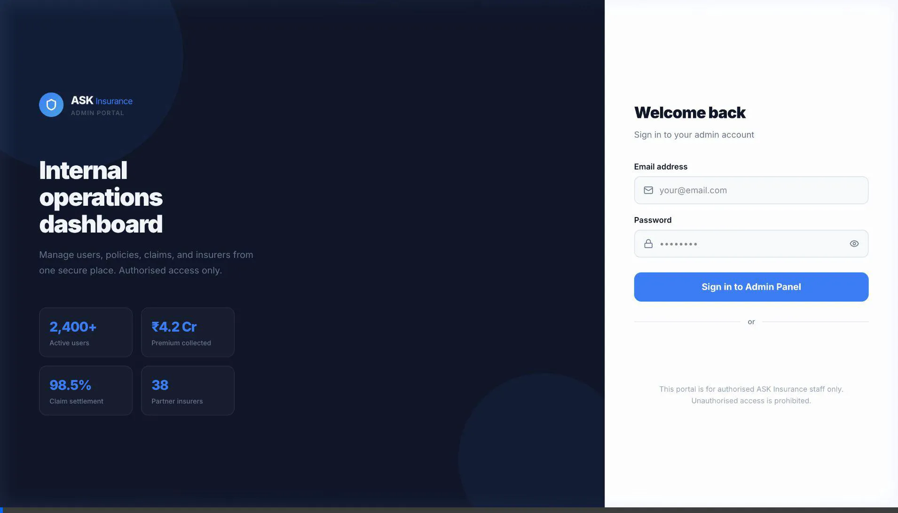
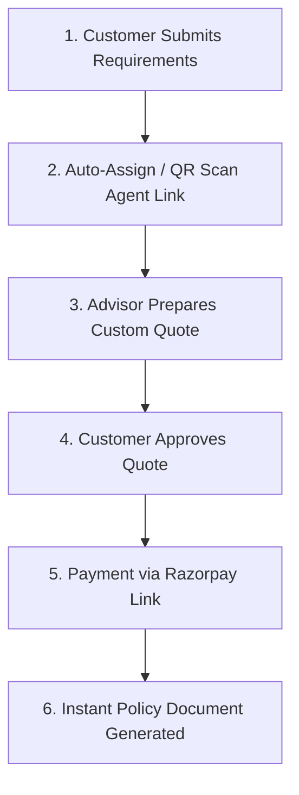

# ASK Insurance Broker

A comprehensive insurance platform that simplifies buying and managing insurance policies in India. Compare 38+ IRDAI-regulated insurers, get instant quotes, and buy policies online.

## 🚀 Features

- **Multi-platform**: Web app (Next.js), Mobile app (React Native/Expo), and Admin dashboard
- **Insurance Comparison**: Compare plans across life, health, motor, travel, and business insurance
- **Instant Quotes**: Get personalized quotes in seconds
- **Secure Payments**: Integrated payment gateway for seamless transactions
- **Claims Management**: Easy claims filing and tracking
- **User Dashboard**: Manage policies, view claims, and track renewals
- **Responsive Design**: Optimized for mobile, tablet, and desktop
- **Real-time Notifications**: SMS, email, and push alerts for policy updates

---

## 📋 Insurance Buying Process



Buying an insurance policy on ASK Insurance is a simple 6-step end-to-end process:



### Step 1: Submit Insurance Requirements

- Open the Customer App (Web or Mobile) and select the desired insurance category (*Health, Motor, Life, Travel, Home, Business*).
- Fill in the required coverage details (Sum Insured, Vehicle Reg. No., Age, Add-ons) and click **Get Quote**.

### Step 2: Advisor Auto-Assignment & QR Linking

- **System Auto-Assign**: The system automatically load-balances and assigns the quote request to an active advisor.
- **Agent QR Scan**: Customers can also scan their agent's QR Code or enter their Agent Code (`AGT-XXXX`) in their profile screen to link themselves to a specific advisor.

### Step 3: Custom Quote Proposal by Advisor

- The assigned advisor receives the quote request in their Agent Mobile App (`/(agent)/quotes`) or Admin Portal.
- The advisor analyzes 38+ partner insurers, customizes the plan, sets the total premium (Net + 18% GST), and submits the quote proposal.

### Step 4: Customer Review & Approval

- The customer receives an instant push/SMS notification.
- The customer reviews the insurer details, plan features, and premium breakdown in their app and taps **Approve Quote**.

### Step 5: Secure Payment

- The advisor generates a secure Razorpay Payment Link and shares it with the customer via WhatsApp, SMS, or Email.
- The customer completes payment via UPI, Credit/Debit Card, or NetBanking.

### Step 6: Policy Activation & Instant Document Download

- Upon Razorpay webhook payment confirmation, the policy activates automatically.
- The official Policy Document (PDF) is immediately available in the customer's **My Policies** tab and emailed directly to their inbox.

---

## 🛠 Tech Stack

### Web Application

- **Framework**: Next.js 16 with App Router
- **Styling**: Tailwind CSS with custom design tokens
- **Language**: TypeScript
- **Deployment**: Vercel

### Mobile Application

- **Framework**: React Native with Expo
- **Navigation**: Expo Router
- **Styling**: NativeWind (Tailwind for React Native)

### Shared Libraries

- **TypeScript**: Shared types and utilities
- **Authentication**: Custom auth context
- **API**: RESTful API integration

### Admin Dashboard

- **Framework**: Next.js
- **Database**: Prisma with PostgreSQL
- **Authentication**: Admin-specific auth

---

## 📁 Project Structure

```text
insurance/
├── web/                    # Next.js web application
│   ├── app/               # App Router pages
│   ├── components/        # Reusable UI components
│   ├── context/           # React contexts (auth, etc.)
│   ├── lib/               # Utilities and helpers
│   └── public/            # Static assets
├── mobile/                # React Native mobile app
│   ├── src/
│   │   ├── app/          # Expo Router screens
│   │   ├── components/   # Mobile components
│   │   └── context/      # Mobile contexts
│   └── assets/           # Mobile assets
├── shared/                # Shared TypeScript libraries
│   └── src/
│       ├── constants/    # App constants
│       ├── tokens/       # Design tokens
│       └── types/        # TypeScript types
├── admin/                 # Admin dashboard (Next.js)
└── package.json          # Root package.json with workspaces
```

---

## 🚀 Getting Started

### Prerequisites

- Node.js 20+
- npm or yarn
- For mobile: Expo CLI (`npm install -g @expo/cli`)

### Installation

1. **Clone the repository**

   ```bash
   git clone <repository-url>
   cd insurance
   ```

2. **Install dependencies**

   ```bash
   npm install
   ```

3. **Set up environment variables**
   - Copy `.env.example` to `.env.local` in each workspace
   - Fill in required API keys and configuration

### Development Commands

- **Web App**: `npm run dev:web` (Opens at `http://localhost:3000`)
- **Mobile App**: `npm run dev:mobile` (Use Expo Go app)
- **Admin Dashboard**: `npm run dev:admin` (Opens at `http://localhost:3001`)
- **API Server**: `npm run dev:api` (Runs on `http://localhost:4000`)
- **All Apps**: `npm run dev:all`
- **Kill Dev Servers**: `npm run kill:dev`

### Production Builds

- **Web**: `npm run build:web`
- **Mobile**: `cd mobile && npx expo build:android`

---

## 📱 Mobile App Features

- **Authentication**: Phone number OTP verification
- **Policy Management**: View and manage all policies
- **Claims**: File and track claims
- **Quotes**: Get instant quotes on mobile
- **Offline Support**: Basic functionality works offline

---

## 🔧 Environment Configuration

Create `.env.local` files in each workspace:

### Web Config (`.env.local`)

```env
NEXT_PUBLIC_API_URL=https://api.askinsurance.com
NEXT_PUBLIC_STRIPE_PUBLISHABLE_KEY=pk_test_...
DATABASE_URL=postgresql://...
```

### Mobile Config (`.env`)

```env
EXPO_PUBLIC_API_URL=https://api.askinsurance.com
EXPO_PUBLIC_STRIPE_PUBLISHABLE_KEY=pk_test_...
```

---

## 🧪 Testing & Linting

```bash
# Run tests for all workspaces
npm run test

# Run linting
npm run lint

# Type checking
npm run type-check
```

---

## 🚀 Deployment

- **Web Portal**: Run `npx vercel --prod`
- **Mobile App**: Run `cd mobile && npx expo build:android --type app-bundle`

---

## 🤝 Contributing & Code Style

1. Fork the repository
2. Create a feature branch (`git checkout -b feature/amazing-feature`)
3. Commit your changes (`git commit -m 'Add amazing feature'`)
4. Push to the branch (`git push origin feature/amazing-feature`)
5. Open a Pull Request

### Guidelines

- Use TypeScript for all new code
- Follow ESLint configuration
- Use conventional commits
- Test your changes thoroughly

---

## 📄 License & Support

This project is licensed under the MIT License - see the [LICENSE](LICENSE) file for details.

- **Email**: `support@askinsurance.com`
- **Website**: [askinsurance.com](https://askinsurance.com)

---

**ASK Insurance Broker** - Making insurance simple